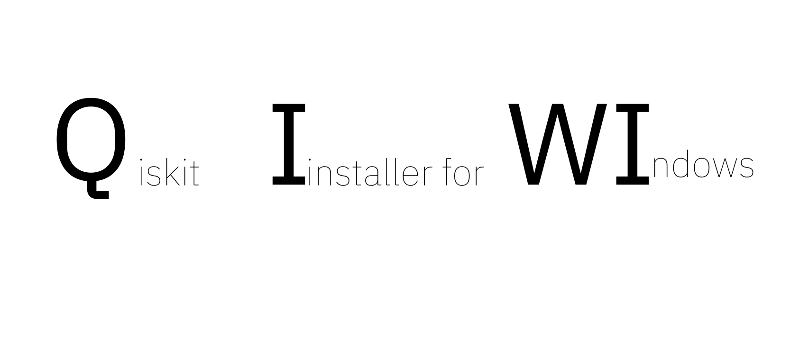

  <h1 align="center">QIWI</h1>

  <!-- PROJECT LOGO -->
   
    
  
    
   

##  📍 What is this repository ?

This repository contains the implementation of QIWI. For more information, please visit the [QIWI website](https://ket-q.github.io/qiskit_windows_installer/).

