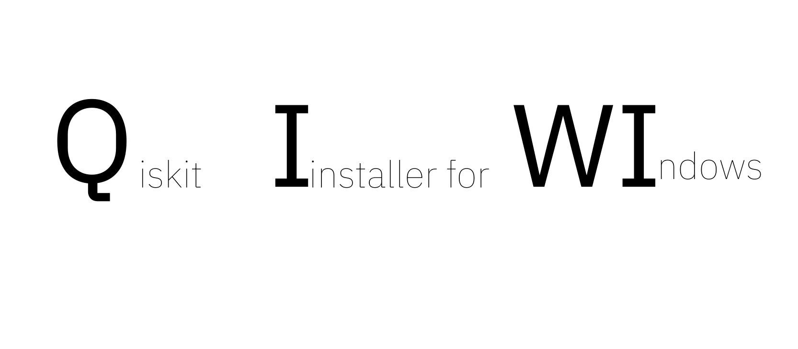

<div align="center">
  <h1 align="center">Qiskit Installer for WIndows</h1>
</div>

<div align="center">

  <!-- PROJECT LOGO -->
  <br />
    
  
    
  <br />
</div>

##  📍 What is QIWI ?

QIWI, the **Q**uiskit **I**nstaller for **WI**ndows, will set up Qiskit and a local copy of Visual Studio Code (VS Code) on your computer, with a ready-to-use Python virtual environment for Jupyter notebooks. After the installation, a Jupyter notebook
walks the user through the initial setup on the IBM Quantum Platform.

<br />

## ⚠️ Important Notices Before Using QIWI

- Only install software on a computer that is not production-level or mission-critical to you. (This is a general truth that does not pertain only to this installer.)

- You are recommended to install Qiskit in a **fresh user account** on your computer.
  - This will help insulate your Qiskit SDK from other software you may have already installed on your computer, particularly if your computer already has a complicated software installation history.
  - Please refer to this [tutorial video](https://www.youtube.com/watch?v=LpPZ1oBjsnM) on how to create a fresh user account.
  - Please log in under this account to install Qiskit.

- Installation requirements for using QIWI:

  - Windows 11 or Windows 10 on the x86 platform
  - At least 4GB of free disk space
  - PowerShell 5.1 (comes pre-installed with both Windows 11 and 10)

<br />


## 💥 Installation

### 🏃 Running the script!   

---

- **Method 1:** (recommended if you're ok with downloading and executing an executable on your computer):

  - Download and execute qiskit_installer.exe ([click here](https://github.com/ket-q/qiskit_windows_installer_pub/raw/refs/heads/main/qiskit_installer.exe)).
  - Windows may present you with a security warning in a blue box because it considers the installer as a security thread. To proceed with the installation,
  please click on "More informations" and "Execute anyway".


---
  
- **Method 2:** (if you want visibility into what you will execute on your computer): Run the provided installation script with Windows PowerShell.

  **Step 1**: Download the script qiskit_installer.ps1 
  - [Click here](https://github.com/ket-q/qiskit_windows_installer_pub/blob/main/qiskit_installer.ps1)
  - Click on "Download raw file" next to the pen ✏️
  
  **Step 2**: Open a PowerShell console
  - Press the Windows key or open the start menu
  - Type "PowerShell" in the search bar and open it.  

  **Step 3**: Navigate to the qiksit_installer.ps1 download file.\
*When opening a PowerShell window, you will be placed in your home directory and you need to change to the Downloads folder (or any other folder where you downloaded the script)*:
  
  ```powershell
  cd ~\Downloads
  ```
  **Step 4** Execute the following command 
  ```powershell
  Set-ExecutionPolicy Bypass -Scope Process -Force && .\qiskit_installer.ps1
  ```

---


### 🚶 Step-by-step guide through the installation process: 

#### Step 1️⃣: Review and accept the license agreements in the pop-up window


#### Step 2️⃣: Wait for the downloading of the packages and the opening of VS Code

VS Code will automaticaly open with a Jupyter notebook that walks you throught
the setup of your API token for the IBM Quantum Platform.

#### Step 3️⃣: Step 3: Follow the step-by-step guide to run Jupyter notebooks and get started on the IBM Quantum Platform. 

This Jupyter notebok includes:
- Selecting a Python interpreter for your Jupyter notebook
- Adding your IBM Quantum API token to the Qiskit installation on your
  local computer. 


*You can also download the setup [notebook](https://github.com/ket-q/qiskit_windows_installer/blob/main/resources/notebook/IBM_account_setup.ipynb) manually. Click on "download raw file" button next to the pen (top-right)*

#### Step 4️⃣ (Optional): We recommended to save this setup notebook in a folder where you keep your quantum computing projects

<br />


## ✏️ Usage 

### 🚩 You need to will to select the correct kernel/interpreter for every new file using Qiskit:  🚩 

---

### With any Jupyter Notebook:


1. Click "Select Kernel" on the top right
2. Click "Python Environnements"
3. Click "qiskit"

### With Non-Jupyter Notebook (Python or Python based):

1. Open the command palette (Ctrl + Shift + P)
2. Select "Python : select interpreter"
3. Select our Qiskit environnement "Python 3.* (Qiskit 1.*)"

You can now run Qiskit on Windows.


## 🔌 Technical information


### Qiskit Windows installer

The installer itself does not stay resident on your computer system.
Rather, it keeps
files isolated in your user account's ``%appdata%`` folder to minimize possible
interference with existing system-wide and/or user-level software installations
you your computer.


## ❓ FAQ / SUPPORT / TROUBLESHOOTING


## 📜 License

[License of this installer](https://github.com/ket-q/qiskit_windows_installer/blob/main/LICENSE)

In addition, you will be asked to accept the following licences during installation:
- [VS Code](https://code.visualstudio.com/license)
- [Qiskit](https://github.com/Qiskit/qiskit/blob/main/LICENSE.txt)
- [Python](https://docs.python.org/3/license.html#terms-and-conditions-for-accessing-or-otherwise-using-python)
- [Pyenv-win](https://pyenv-win.github.io/pyenv-win/#license-and-copyright)


